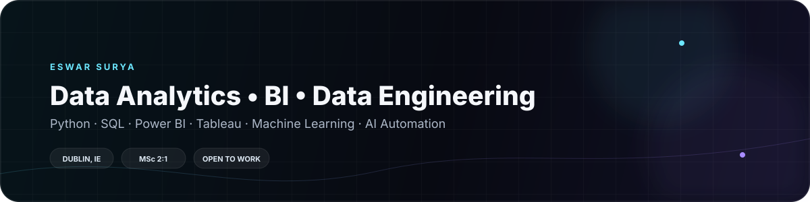

  

### Data Analyst · Business Intelligence · Data Engineering · Machine Learning

📍 Dublin, Ireland · 🎓 MSc Data Analytics (2:1)

> I turn messy data into decision-ready analysis, dashboards, and machine-learning workflows — with a strong focus on data quality, explainability, and practical delivery.

I'm an MSc Data Analytics graduate building a portfolio across **Python, SQL, Power BI, Tableau, PostgreSQL, and applied machine learning**. I also explore **AI-assisted development, n8n workflow automation, APIs, and agent-based workflows**.

### What I'm focused on

- **Analytics & BI** — KPI reporting, exploratory analysis, dashboards, SLA analysis, business reporting
- **Data Engineering** — SQL, PostgreSQL, ETL concepts, data modelling, data pipelines, API-based ingestion
- **Machine Learning** — anomaly detection, Isolation Forest, SHAP explainability, LSTM and time-series workflows
- **AI & Automation** — n8n, API workflows, AI tools, agent workflows, rapid prototyping

---

## ⭐ Featured Work

| Project | What it demonstrates |
| --- | --- |
| [🧠 Human Vitals Anomaly Detection Thesis](https://github.com/eswarsurya/human-vitals-anomaly-detection-thesis) | MSc thesis · Isolation Forest · SHAP · explainable anomaly detection |
| [⚙️ Human Vitals Anomaly API](https://github.com/eswarsurya/human-vitals-anomaly-api) | Flask REST API · ML inference · Docker · deployment-oriented architecture |
| [📊 Customer Support Ticket Analytics BI](https://github.com/eswarsurya/customer-support-ticket-analytics-bi) | Power BI · Tableau · SLA analysis · data quality · operational analytics |
| [🏎️ Formula 1 Analytics](https://github.com/eswarsurya/formula1-analytics) | FastF1 API · ETL pipeline · Pandas · analytics workflow |
| [⏱️ LSTM Time-Series Anomaly Detection](https://github.com/eswarsurya/lstm-anomaly-detection-timeseries) | Sequence modelling · time-series analysis · anomaly review |
| [🛒 Walmart Sales Analytics](https://github.com/eswarsurya/walmart-sales-analytics-python-sql) | Python · SQL · retail analytics · business reporting |
| [📈 Bike Sales Dashboard](https://github.com/eswarsurya/bike-sales-dashboard-tableau-project) | Tableau · dashboard design · sales and resale analysis |

---

## 🧰 Technical Toolbox

| Area | Tools |
| --- | --- |
| **Languages** | Python · SQL · R |
| **Analytics & BI** | Power BI · DAX · Power Query · Tableau · Excel |
| **Python Data Stack** | Pandas · NumPy · scikit-learn · SHAP · Matplotlib |
| **Databases** | PostgreSQL · MySQL |
| **Data Engineering** | ETL · data modelling · data quality · API ingestion · pipeline concepts |
| **Machine Learning** | Isolation Forest · anomaly detection · LSTM · time-series analysis · model explainability |
| **Development** | Git · Linux · Jupyter · Flask · Docker |
| **Automation & AI** | n8n · APIs · AI-assisted development · agent workflows · prompt design |

---

## 🔎 How I Approach Projects

**1. Start with the business question**  
I define what needs to be measured, explained, or improved before choosing the analysis.

**2. Treat data quality as part of the work**  
I check structure, missing values, consistency, leakage risks, and public-sharing constraints before drawing conclusions.

**3. Build something reviewable**  
Projects include reusable code, clear outputs, documentation, and a README that explains how the work can be reproduced or inspected.

**4. Communicate the result**  
The goal is not only to produce a model or dashboard, but to make the output understandable to a stakeholder or hiring manager.

---

## 🤖 Current Focus

- AI-assisted analytics and automation workflows with **n8n + APIs**
- Practical **AI/LLM workflows and agent tooling**
- Extending completed analytics projects with stronger **data engineering and API patterns**
- Building deeper foundations around **ETL, modelling, databases, APIs, and cloud concepts**

---

## 🎓 Education

**MSc Data Analytics — Dublin Business School**  
2025–2026 · **2:1**

**B.Tech Computer Science & Engineering — Vel Tech Rangarajan Dr. Sagunthala R&D Institute of Science and Technology**  
2020–2024 · **CGPA 8.39 / 10**

---

## 🌐 Portfolio & Contact

🌐 **Portfolio:** [eswardanaboina.vercel.app](https://eswardanaboina.vercel.app/)  
💼 **LinkedIn:** [linkedin.com/in/eswarsurya76](https://www.linkedin.com/in/eswarsurya76/)  
📧 **Email:** [eswarsurya89@gmail.com](mailto:eswarsurya89@gmail.com)  
📁 **Projects:** [github.com/eswarsurya](https://github.com/eswarsurya)

---

### Open to

**Graduate / Junior Data Analyst · BI Analyst · Data Engineer · Analytics Engineer · ML/AI-adjacent roles**

I'm interested in roles where I can combine **analysis, engineering thinking, automation, and clear business communication**.

> *Build it. Measure it. Explain it. Improve it.*
